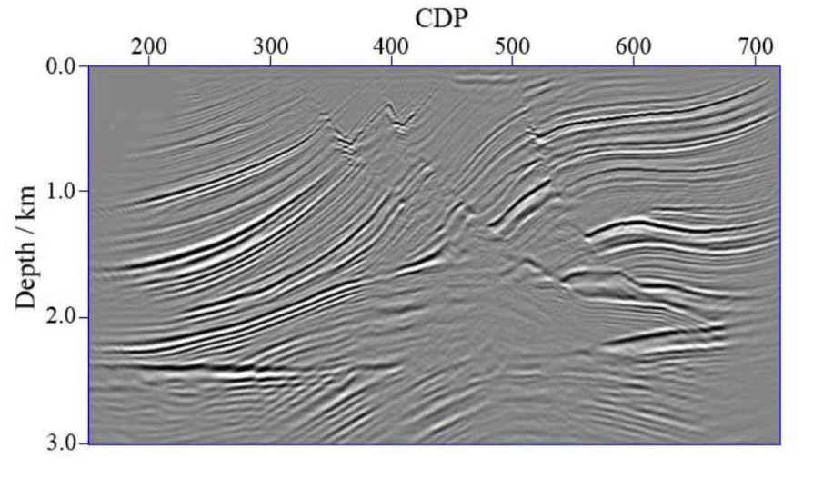
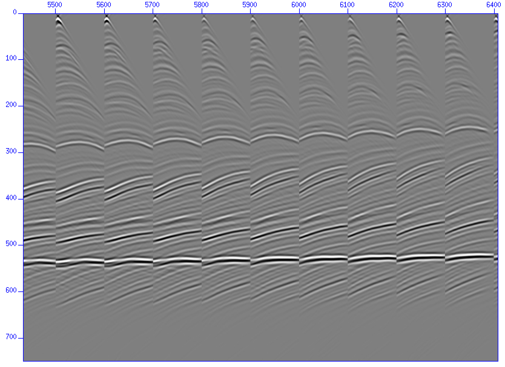

# Gaussian Beam for Forward and Migration (GBFM)

## Table of Contents

- [Gaussian Beam for Forward and Migration (GBFM)](#gaussian-beam-for-forward-and-migration-gbfm)
  - [Table of Contents](#table-of-contents)
  - [Introduction](#introduction)
  - [Picture](#picture)
  - [Installation](#installation)
  - [Usage](#usage)
  - [Contributing](#contributing)

## Introduction

This is a software package for Gaussian beam forward modeling and migration.

Gaussian beam method is a high-frequency asymptotic method for solving wave equation, usually used for seismic imaging. 
The key formula of GBM is

$$
u(s,n,\omega )=\Psi \sqrt{\frac{V(s)}{Q(s)} }exp\left\{i\omega\tau (s)+\frac{i\omega }{2V(s)}K(s)n^{2}-\frac{n^{2} }{L^{2}(s) } \right\}  
$$

We use this formula for seismic forward modeling and migration. During forward modeling, a reflection coefficient profile is usually required, while during migration, a common shot domain gather and a smooth velocity model are required.

## Picture

*Gaussian beam migration of Marmousi model*

*Gaussian beam forward modeling of Marmousi model*

## Installation

make

make install 

## Usage

see demo directory

## Contributing

changzm23@mails.jlu.edu.cn

caoyq23@mails.jlu.edu.cn

